<h1 style="font-size: 2em;">SakuraChat</h1>
日本語学習者を目的とした、ソーシャル掲示板アプリ。
  
  

<h1 style="font-size: 1.5em;">使用した技術</h2>
・Swift, SwiftUI  
・naturalLanguage, combine, photosUI   
・firebase  
・github, xcode  
  

<h1 style="font-size: 1.5em;">アプリビューと機能</h2>
<h2>アプリビュー</h2>
<table>
  <tr>
    <td style="width: 230px;">
      
認証ビュー

      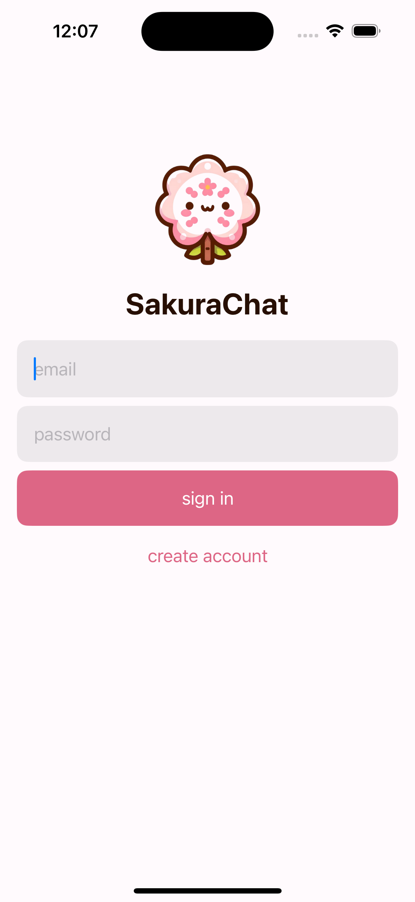
    </td>
    <td style="width: 230px;">
      
ポストリストビュー

      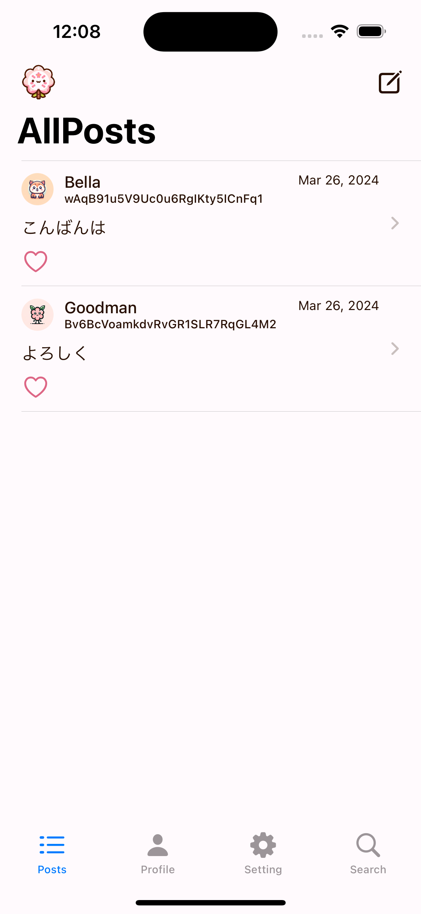
    </td>
    <td style="width: 230px;">
      
プロフィールビュー

      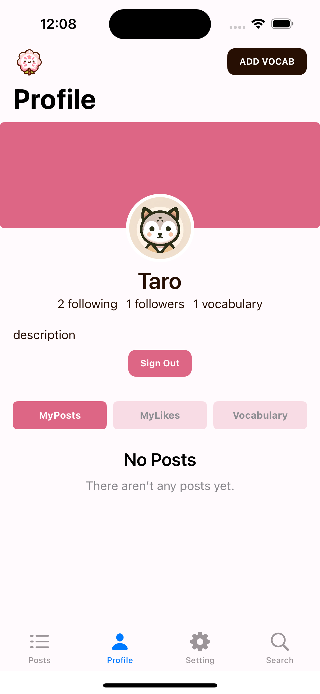
    </td>
    <td style="width: 230px;">
      
設定ビュー

      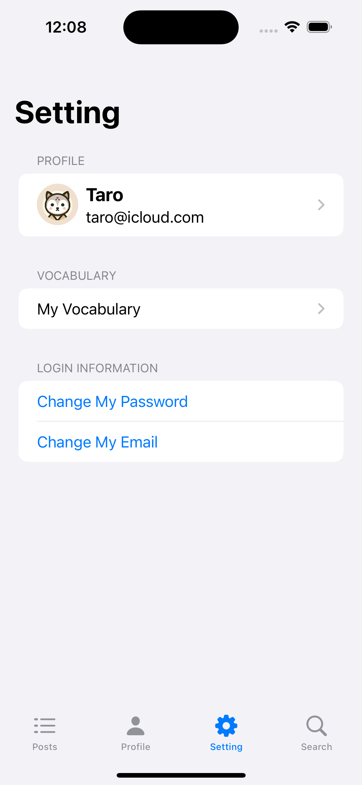
    </td>
    <td style="width: 230px;">
      
ユーザー検索ビュー

      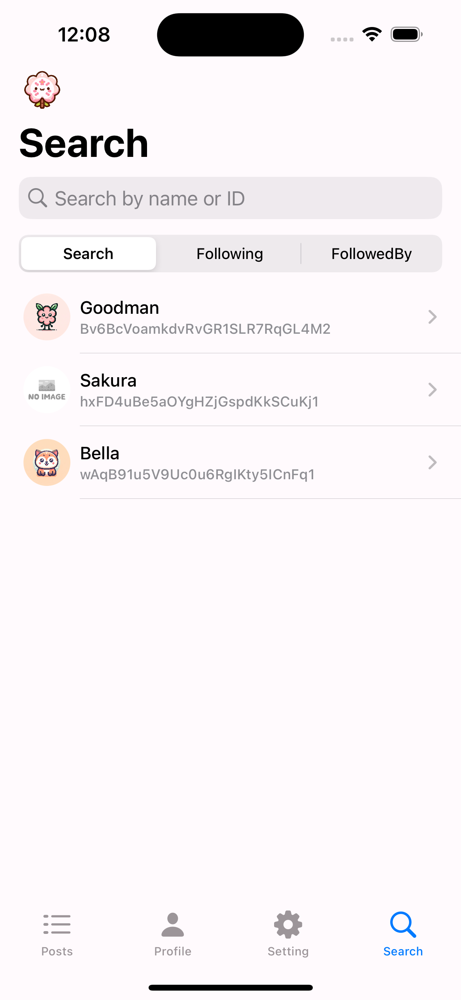
    </td>
  </tr>
</table>
  
<h2>機能</h2>
<h3 style="font-size: 1.0em;">投稿チェックと単語帳</h3>
<table>
  <tr>
    <td style="width: 230px;">
      
ポストとコメントのチェック

      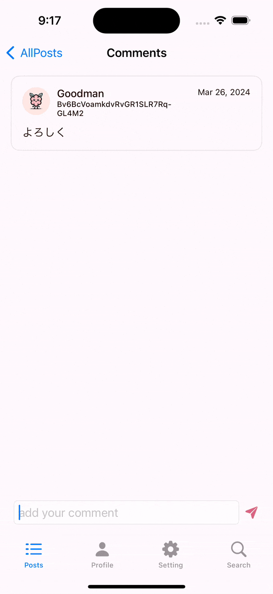
    </td>
    <td style="width: 230px;">
      
単語帳に語彙を追加する

      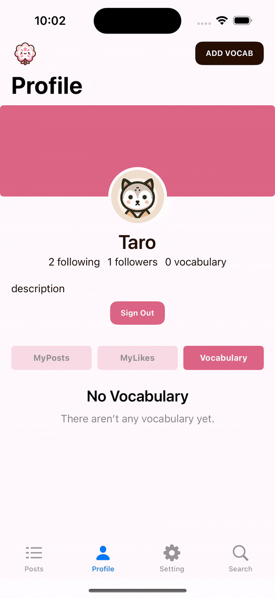
    </td>
  </tr>
</table>

<h3 style="font-size: 1.0em:">サインイン、サインアウト、アカウント作成</h3> 
<table>
  <tr>
    <td style="width: 230px;">
      
サインイン

      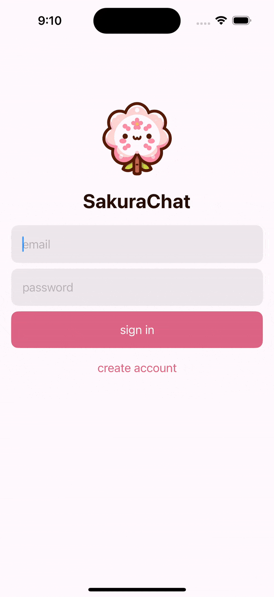
    </td>
    <td style="width: 230px;">
      
サインアウト

      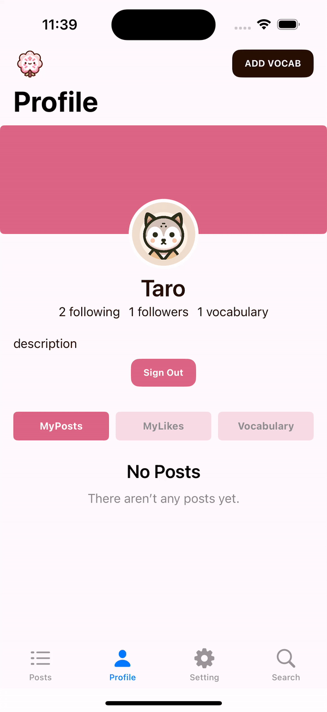
    </td>
    <td style="width: 230px;">
      
アカウント作成

      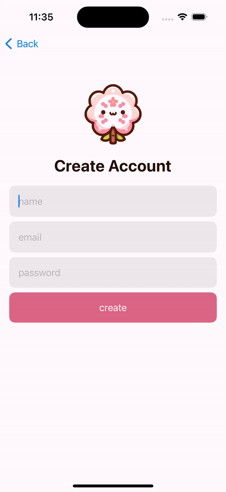
    </td>
  </tr>
</table>
<h3 style="font-size: 1.0em:">ポスト、コメント、消去</h3>
<table>
  <tr>
    <td style="width: 230px;">
      
ポスト

      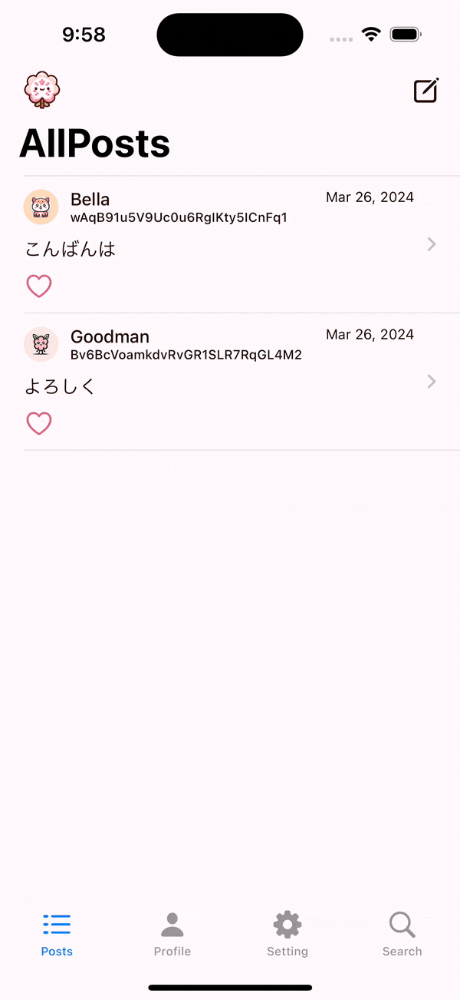
    </td>
    <td style="width: 230px;">
      
コメント

      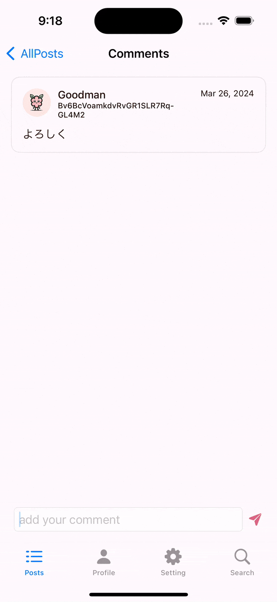
    </td>
    <td style="width: 230px;">
      
消去

      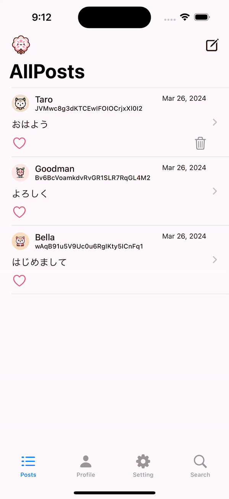
    </td>
  </tr>
</table>

<h3 style="font-size: 1.0em:">フォロー</h3> 
<table>
  <tr>
    <td>
      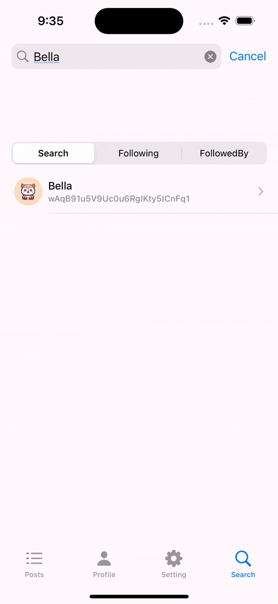
    </td>
  </tr>
</table>

<h3 style="font-size: 1.0em:">ログインメール、パスワード、プロフィール変更</h3> 
<table>
  <tr>
    <td>
     
    </td>
  </tr>
</table>

